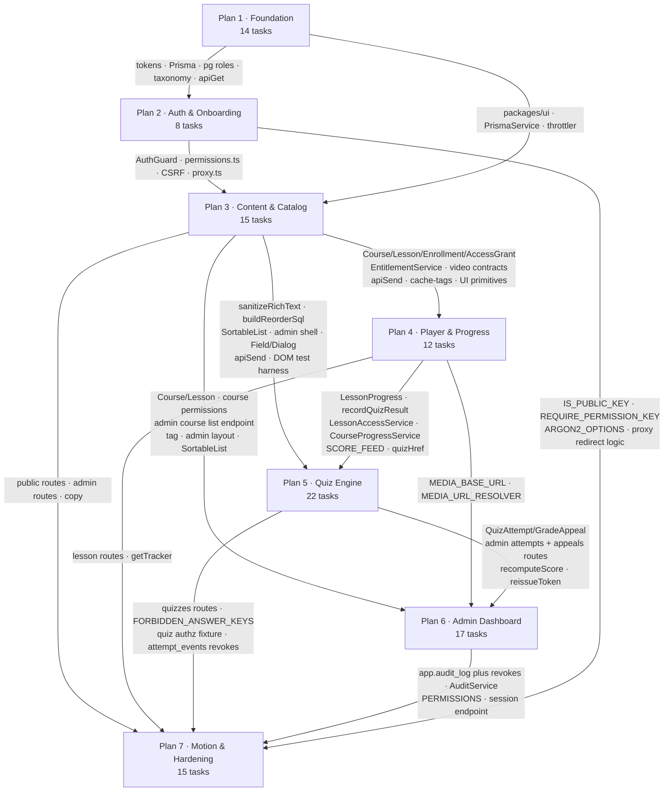

# منصة م. أيمن أبو العيلة — Implementation Plans

**Spec:** [`../specs/2026-07-25-ayman-platform-design.md`](../specs/2026-07-25-ayman-platform-design.md)
**Reconciled:** 2026-07-26 (cross-plan pass over Plans 3–7)

This file is the **ownership register**. Where a plan document and this file disagree about who
owns a model, a route, a component or a copy key, **this file wins** — fix the plan, do not add a
shim. Every plan carries a `## Depends on` section naming exactly what it consumes and from where.

---

## Build order

| # | Plan | Spec §10 items | Tasks | Steps |
|---|---|---|---|---|
| 1 | [`2026-07-25-plan-1-foundation.md`](2026-07-25-plan-1-foundation.md) | 1–4 | 14 | — |
| 2 | [`2026-07-26-plan-2-auth-onboarding.md`](2026-07-26-plan-2-auth-onboarding.md) | 5–6 | 8 | — |
| 3 | [`2026-07-26-plan-3-content-catalog.md`](2026-07-26-plan-3-content-catalog.md) | 7–8 | **15** | 111 |
| 4 | [`2026-07-26-plan-4-player-progress.md`](2026-07-26-plan-4-player-progress.md) | 9 | **12** | 94 |
| 5 | [`2026-07-26-plan-5-quiz-engine.md`](2026-07-26-plan-5-quiz-engine.md) | 10–11 | **22** | 119 |
| 6 | [`2026-07-26-plan-6-admin-dashboard.md`](2026-07-26-plan-6-admin-dashboard.md) | 12–13 | **17** | 155 |
| 7 | [`2026-07-26-plan-7-motion-polish-hardening.md`](2026-07-26-plan-7-motion-polish-hardening.md) | 14–15 | **15** | 116 |

**Total across Plans 3–7: 81 tasks** (595 checkbox steps).
Including Plans 1–2: **103 tasks**.

The order is strictly sequential. **Plan 5 must land before Plan 6** — Plan 6 Task 11 renders
screens over Plan 5's attempt and appeal endpoints, and Plan 6 Task 3 retrofits auditing into the
services Plans 3–5 created. There is no cycle: Plan 5 consumes only UI primitives, the admin shell
and `apiSend` from Plan 3, and progress services from Plan 4.

---

## What each plan does

**Plan 1 — Foundation.** Stands up the pnpm + Turborepo workspace, the `ayman/no-physical-direction`
ESLint rule, the OKLCH design-token system with IBM Plex Sans Arabic / Plex Mono at weights
400–700, the Next.js 16 RTL shell with a FOUC-free theme toggle, the NestJS 11 skeleton with a
Zod-validated config that crashes at boot on a missing key, Prisma 7 wired for schema `app` with
three least-privilege Postgres roles, and the البكالوريا taxonomy seeded in official national-ID
code order. It ends with a real Arabic page rendering the 27 governorates fetched from Postgres
through NestJS across the single origin.

**Plan 2 — Auth & onboarding.** Better Auth hosted inside NestJS with the Prisma adapter,
Argon2id at m=19456/t=2/p=1, and NestJS guards as the sole authorization authority. Ships the
deny-by-default `AuthGuard`, `@Public()`, `@CurrentUser()`, `@RequirePermission()` and the
`permissions.ts` catalogue every later plan appends to; login hardening (identical errors, dummy-hash
timing, email+IP joint throttling, progressive delay); the 9-field three-step onboarding with the
conditional taxonomy logic enforced in Zod *and* in a Postgres `CHECK`; the أجهزتي device list; and
`proxy.ts` with the security headers and the CSRF guard.

**Plan 3 — Content & catalog.** The content tree (`Course` → `CourseSection` → `Lesson` → video /
text / attachment payloads), the YouTube id extractor that eliminates the SSRF class by parsing and
discarding the URL, `sanitizeRichText()` on every HTML write, and entitlement as an `AccessGrant`
**object** rather than a boolean. Admin CRUD with drag-reorder that writes 40 lessons in **one**
`UPDATE … FROM (VALUES …)`, the whole `@ayman/ui` form primitive set, the first DOM test harness,
the `(admin)` shell, the cache-tag builder, and the SSR'd `'use cache'` public catalog with
`ItemList` + `Course` + `BreadcrumbList` JSON-LD, `sitemap.ts` and `robots.ts`.

**Plan 4 — Course player & progress.** The client is a reporter, never an authority. 10-second
`{position, delta}` heartbeats that the **server** accumulates against its own wall clock, the
two-threshold completion rule (`max_position ≥ 0.95 × duration` **and** `watched ≥ 0.70 × duration`,
so a scrub-to-end provably does not complete a lesson), `LessonAccessService.require` as the single
ownership gate returning 404 rather than 403, the RTL-native player shell with a lazily-loaded
`youtube-nocookie` iframe at CLS 0, session-keyed throttling, and a dashboard with
continue-watching, real course percentages and `last_lesson_id` resume.

**Plan 5 — Quiz engine.** The largest plan: a versioned question bank keyed on the
`{option, fraction}` primitive (never `is_correct`), an admin quiz builder with bulk text import,
Moodle's four grading algorithms ported verbatim with their float epsilons intact, hybrid attempt
storage (one mutable row per question *plus* an append-only event log), version and option-order
snapshots taken at attempt creation, a persisted `deadline_at` that is never recomputed, an
`attempt_token` compiled into every write's `WHERE` clause, the 4×7 review matrix resolved
server-side, the التظلم appeal flow, admin unlock shipped **before** launch, item analytics — and a
three-layer defence proving correct answers never reach the browser before submission.

**Plan 6 — Admin dashboard & platform configuration.** The founder's headline requirement: every
single thing on the site is controlled from the dashboard. Students, attempts and appeals, the full
taxonomy including its Arabic labels, homepage block composition, the navigation builder, branding
constrained to token slots with no free-text colour input anywhere, feature flags, and a media
library whose upload pipeline is extension allowlist → magic-byte sniff of the buffer → `sharp`
re-encode → UUID key, served from a different origin. Every mutation is hash-chained into an
`INSERT`-only audit log, and every public read of that configuration is a `'use cache'` loader the
admin's own save invalidates with `updateTag()`.

**Plan 7 — Motion, atmosphere & security hardening.** Part A gives the platform its motion layer
without spending a millisecond of LCP: variants as plain data in `packages/ui`, `<LazyMotion strict>`
in one client leaf, one orchestrated scroll moment per page, Shiki highlighting on the server, one
WebGL plane, one 3D object gated on reduced-motion **and** a desktop query so mobile never fetches
the `three` chunk. Part B closes the security pass: Redis-backed throttling, verified append-only
audit and event tables with bounded runtime sessions, a report-only CSP split by route, an
authorization matrix over every registered route × role, CI gates that `--no-verify` cannot bypass,
and Playwright + axe on the three flows and every public route.

---

## Dependency diagram

---

## Global Constraints

Restated verbatim at the head of every plan's own Global Constraints section. All nine are binding
on every task in Plans 3–7.

1. **Single origin.** `apps/web` serves `/`, `apps/api` serves `/api`. **Never configure CORS.** The
   API host may appear only in `next.config.ts` and `apps/web/lib/api.ts` (plus
   `NEXT_PUBLIC_MEDIA_ORIGIN`, the deliberate third exception, from Plan 6).
2. **Ports:** web `3200`, api `3300`. Port 3000 is occupied by an unrelated service on this machine.
3. **RTL is native, not mirrored.** Logical Tailwind utilities only. `ayman/no-physical-direction`
   sees through `cn()`/`clsx()`, template literals, ternaries, arrays, object keys and module-level
   class constants.
4. **No user-facing string literals outside `packages/contracts`.** `app/dev/*` is exempt;
   `app/(admin)/*` and `app/(site)/*` are not.
5. **Extensionless relative imports.** `apps/api` uses `module: Preserve` + `moduleResolution:
   Bundler` with `noEmit: true`; SWC does the real CommonJS emit. Any `packages/contracts` leaf that
   `apps/api` imports **for its runtime value** needs an explicit subpath export.
6. **Every Prisma model gets `@@schema("app")`**, every enum gets `@@map` to a snake_case type name,
   and `prisma generate` does **not** run automatically after `migrate`.
7. **NestJS guards are the sole authorization authority.** Permissions are `resource:action`
   strings — never a role equality check, never a third colon. Deny by default.
8. **Separate DTOs per role**, `whitelist: true` + `forbidNonWhitelisted: true`. The realistic
   attack is a student PATCHing `{completed:true}` or `{score:100}` onto their own row.
9. **Design:** no gradients, no glassmorphism, no emoji icons, radius ≤ 8px on cards, no shadows in
   dark mode, amber `--a-9` used flat. **`--ok` green and `--err` red are reserved for quiz
   correctness** and never decorative. The one sanctioned non-quiz use of `--err` is `FieldError`.

Plus, everywhere: **never `$queryRawUnsafe` / `$executeRawUnsafe`** (ESLint `no-restricted-syntax`
hard-fails both; sort and table names map through hardcoded whitelists because column names cannot
be parameterised), and **commit after every task** with explicit `git add` paths.

---

## Ownership register

### Prisma models

| Owner | Models |
|---|---|
| Plan 1 | `Governorate`, `EducationSystem`, `AcademicYear`, `Track`, `TrackFaculty`, `Subject`, `SubjectOffering`, `ElectiveGroup` |
| Plan 2 | `User`, `Session`, `Account`, `Verification`, `StudentProfile`, `SessionDevice` |
| Plan 3 | `Course`, `CourseSection`, `Lesson`, `LessonVideo`, `LessonText`, `LessonAttachment`, **`Enrollment`**, **`AccessGrant`**; enums `CourseStatus`, `LessonKind`, `VideoProvider`, `CompletionMode`, `EnrollmentStatus`, `EnrollmentSource`, `AccessScope`, `GrantSource`, `ScholarshipKind` |
| Plan 4 | **`LessonProgress`** only; enums `LessonProgressState`, `CompletionSource`; back-relations `Enrollment.progress`, `Lesson.progress` |
| Plan 5 | `QuestionCategory`, `QuestionBankEntry`, `QuestionVersion`, `QuestionOption`, `Quiz`, `QuizSlot`, `QuizPool`, `QuizAttempt`, `AttemptQuestion`, `AttemptEvent`, `GradeAppeal` + 10 enums |
| Plan 6 | `SiteSetting`, `FeatureFlag`, `NavigationItem`, `HomeBlock`, `MediaAsset`, `AuditLog` |
| Plan 7 | none |

Canonical `EnrollmentStatus` = `active | suspended | expired | revoked | completed`.
Canonical `GrantSource` = `auto_free | admin | access_code | purchase | coupon | scholarship`.
Canonical `Enrollment` fields include `source`, `enrolledAt`, `expiresAt`, `completedAt`,
`progressPercent`, `lastLessonId`.

### Routes

| Surface | Owner | Path |
|---|---|---|
| Public catalog | Plan 3 | `app/(site)/courses/**` |
| Course player | Plan 4 | `app/(app)/courses/[slug]/lessons/[lessonId]/**` |
| Dashboard | Plan 4 | `app/(app)/dashboard` |
| Quiz runner | Plan 5 | `app/(app)/quizzes/[lessonId]/**` |
| Admin shell | Plan 3 creates, Plan 6 replaces its body | `app/(admin)/layout.tsx` |
| Admin content | Plan 3 | `app/(admin)/admin/courses/**` |
| Admin quiz | Plan 5 | `app/(admin)/admin/{questions,quizzes,appeals}/**` |
| Admin platform | Plan 6 | `app/(admin)/admin/{students,attempts,taxonomy,settings,flags,navigation,home,media,audit}/**` |

There is **no `/learn` segment**. There is exactly **one** admin layout and **one** `<Toaster/>`.

### API prefixes

`/api/catalog/*` and `/api/admin/courses|sections|lessons/*` → Plan 3 ·
`/api/lessons/*`, `/api/me/dashboard`, `/api/enrollments` (read model) → Plan 4 ·
`/api/quiz/*` and `/api/admin/{questions,quizzes,appeals,attempts}/*` → **Plan 5** ·
`/api/admin/{settings,students,taxonomy,flags,navigation,home-blocks,media,audit}/*`,
`/api/{settings,navigation,flags,home-blocks}`, `/media/*` → Plan 6 ·
`/api/security/csp-report` → Plan 7.

Plan 6 defines **no** quiz, attempt or appeal endpoint. It renders screens over Plan 5's.

### Shared modules

| Artifact | Owner | Consumers |
|---|---|---|
| `apps/api/src/auth/permissions.ts` | Plan 2 | 3, 4, 5, 6 **append** — never replace |
| `apps/api/src/common/sanitize/rich-text.ts` → `sanitizeRichText(html)` | Plan 3 | 5 |
| `apps/api/src/modules/content/reorder.sql.ts` → `buildReorderSql` | Plan 3 | 5 (`quiz_slots`), 6 (`navigation_items`, `home_blocks`) |
| `EntitlementService.resolveCourseAccess` / `.ensurePlatformGrant` | Plan 3 | 4, 5 |
| `LessonAccessService.require(userId, lessonId)` | Plan 4 | 5 |
| `LessonProgressService.recordQuizResult({ userId, lessonId, passed, scaledScore, gradeOutOf })` | Plan 4 | 5 |
| `CourseProgressService.recalculate(tx, enrollmentId, courseId)` | Plan 4 | 5 |
| `SCORE_FEED` + `ScoreFeed.recentFor(userId, limit)` | Plan 4 | 5 rebinds to `QuizScoreFeed` |
| `AttemptService.recomputeScore` / `.reissueToken` | Plan 5 | 6 |
| `AuditService.record()` + `AUDIT_ACTIONS` | Plan 6 | retrofitted into 3 and 5 by Plan 6 Task 3 |
| `MediaStorage` + `MEDIA_STORAGE` | Plan 6 | Plan 3's attachments migrate onto it |
| `MEDIA_URL_RESOLVER` + `MEDIA_BASE_URL` | Plan 4 | Plan 6 rebinds onto `MediaStorage` |
| `apps/web/lib/api.ts` → `apiGet` (P1), `apiGetOrNull` + `apiSend` (P3), `apiPost` (P4) | as marked | all |
| `apps/web/lib/cache-tags.ts` → `tag()`, `assertTagBudget()` | Plan 3 | Plan 6 extends with `tags.*` |
| `apps/web/lib/quiz-links.ts` → `quizHref(lessonId)` | Plan 4 | Plan 5 |
| `apps/web/components/admin/sortable-list.tsx` → `SortableList` | Plan 3 | 5, 6 |
| `apps/web/proxy.ts` `PROTECTED_PREFIXES` | Plan 2 | 3 adds `/admin`, 5 adds `/quizzes` |
| `@ayman/ui` `Input`/`Textarea`/`Select`/`Label`/`Field`+`issuesForPath`/`Checkbox`/`RadioGroup`/`Dialog` | Plan 3 | 5, 6 |
| `@ayman/ui` `Switch`/`DropdownMenu`/`Table`/`Kbd` | Plan 6 | — |
| `useDataTable` / `DataTable` family | Plan 6 | — |
| vitest + jsdom harness for `apps/web` and `packages/ui` | Plan 3 Task 10 Step 0 | 4, 5, 6, 7 |

### Permission catalogue

Shape is strictly `^[a-z][a-z-]*:[a-z][a-z-]*$` — **two segments, one colon.**

| Owner | Permissions |
|---|---|
| Plan 2 | `profile:read`, `profile:write`, `course:read` |
| Plan 3 | `course:create`, `course:update`, `course:publish`, `course:delete`, `section:write`, `section:reorder`, `lesson:write`, `lesson:reorder`, `enrollment:read`, `enrollment:create` |
| Plan 4 | `progress:read`, `progress:write` |
| Plan 5 | `question:read`, `question:write`, `quiz:read`, `quiz:write`, `quiz:attempt`, `quiz:grade`, `attempt:grade`, `appeal:create`, `analytics:read` |
| Plan 6 | `admin:access`, `attempt:read`, `attempt:unlock`, `appeal:read`, `appeal:resolve`, `settings:*`, `flags:*`, `nav:*`, `home:*`, `media:*`, `taxonomy:*`, `student:read`, `student:write`, `student:role-change`, `audit:read` |

**Student set** (the union Plans 2–5 append, asserted in `permissions.spec.ts`):
`appeal:create`, `course:read`, `enrollment:create`, `enrollment:read`, `profile:read`,
`profile:write`, `progress:read`, `progress:write`, `quiz:attempt`, `quiz:read`.
Admin holds `'*'`.

### Arabic copy namespaces (`packages/contracts/src/copy/ar.ts`)

| Owner | Top-level keys |
|---|---|
| Plan 1 | `common`, `nav`, `taxonomy` |
| Plan 2 | `auth`, `onboarding`, `settings` |
| Plan 3 | `catalog`, `course`, and `admin.{common, nav, course, section, lesson, reorder}` |
| Plan 4 | `player`, `dashboard`, `enrollment` |
| Plan 5 | `quiz`, `quizErrors`, `appeal`, `quizAdmin` |
| Plan 6 | the rest of `admin.*` — `title`, `list`, `actions`, `shortcuts`, `students`, `taxonomy`, `settings`, `branding`, `flags`, `navigation`, `home`, `media`, `audit` — plus appended entries under `admin.nav` and `admin.common` |
| Plan 7 | `a11y`, `code`, `showpiece` |

`copy.admin` is the only **shared** namespace, split by sub-key. A plan may add keys only under a
namespace it owns or a sub-namespace explicitly reserved for it, and appends — never replaces.

### CSRF and cookies

One convention across every plan: header **`x-csrf-token`**, double-submit value read from the
**`__Host-csrf`** cookie. Plan 2's guard must accept `Sec-Fetch-Site ∈ {same-origin, none}` **and
absent** — `apiSend` runs inside a Next Server Action, a server-to-server request that carries
neither `Origin` nor `Sec-Fetch-Site`.

### Test-file globs

Four runners, four disjoint globs — do not widen any of them.

| Runner | Glob | Package |
|---|---|---|
| Jest + SWC (unit) | `*.spec.ts` | `apps/api` |
| Jest (integration) | `*.int-spec.ts` | `apps/api` (Plan 7 Task 9) |
| Vitest + jsdom | `*.test.ts(x)` | `apps/web`, `packages/ui`, `packages/contracts` |
| Playwright | `*.e2e.ts` | `apps/web` (Plan 7 Task 14) |

---

## Version pins

Identical in every plan that names them. Verified against the npm registry 2026-07-26.

| | | | |
|---|---|---|---|
| pnpm `11.17.0` | Turborepo `2.10.0` | TypeScript `5.9.x` | Node `24 LTS` |
| Next.js `16.2.11` | React `19.2.8` | Tailwind `4.3.3` | NestJS `11.1.28` |
| Prisma `7.9.0` | PostgreSQL `16.14` | Redis `7.x` | Zod `4.4.3` |
| `nestjs-zod` `5.5.0` | `better-auth` `1.6.25` | `@thallesp/nestjs-better-auth` `2.7.0` | `argon2` `0.45.1` |
| `@nestjs/throttler` `6.5.0` | `@nestjs/schedule` `6.1.3` | `ioredis` `5.11.1` | `@nest-lab/throttler-storage-redis` `1.2.0` |
| react-hook-form **`7.83.0`** (not v8) | `@hookform/resolvers` `5.5.3` | `@tanstack/react-table` **`8.21.3`** (not v9) | `nuqs` `2.9.2` |
| `@dnd-kit/core` `6.3.1` | `@dnd-kit/sortable` `10.0.0` | `@dnd-kit/utilities` `3.2.2` | `@dnd-kit/modifiers` `9.0.0` |
| `sanitize-html` `2.17.6` | `@types/sanitize-html` `2.16.1` | `isomorphic-dompurify` `3.19.0` | `libphonenumber-js` `1.13.9` |
| `sonner` `2.0.7` | `cmdk` `1.1.1` | `lucide-react` `1.27.0` | `sharp` `0.35.3` |
| `file-type` `22.0.1` | `motion` `12.42.2` | `@bprogress/next` `3.2.12` | `shiki` `4.3.1` |
| `ogl` `1.0.11` | `three` `0.185.1` | `@react-three/fiber` `9.6.1` | `@react-three/drei` `10.7.7` |
| `@playwright/test` `1.62.0` | `@axe-core/playwright` `4.12.1` | `jsdom` `27.0.0` | `@testing-library/react` `16.3.0` |
| `@testing-library/jest-dom` `6.9.1` | | | |

Explicitly rejected: `framer-motion`, NextAuth, Drizzle, TypeORM, TanStack Table v9, RHF v8,
`@dnd-kit/react`, `nprogress`, class-validator, Nx, repo-wide CQRS, `FAQPage` JSON-LD.

One documented fallback: if `file-type@22`'s ESM-only build cannot be dynamically imported under
SWC, Plan 6 Task 13 falls back to `file-type@16.5.4` (the maintained CommonJS branch,
`dist-tag: version-16`, API `FileType.fromBuffer`) and records the swap. That is a contingency, not
a competing pin.

---

## Executing a plan

Each plan opens with `REQUIRED SUB-SKILL: superpowers:subagent-driven-development` (or
`superpowers:executing-plans`) and uses `- [ ]` checkboxes per step. Read the plan's
**Reconciliation notes** and **Depends on** sections before Task 1 — they are where the
cross-plan contracts live, and several tasks were deliberately reduced in scope because an earlier
plan already ships what they used to declare.
